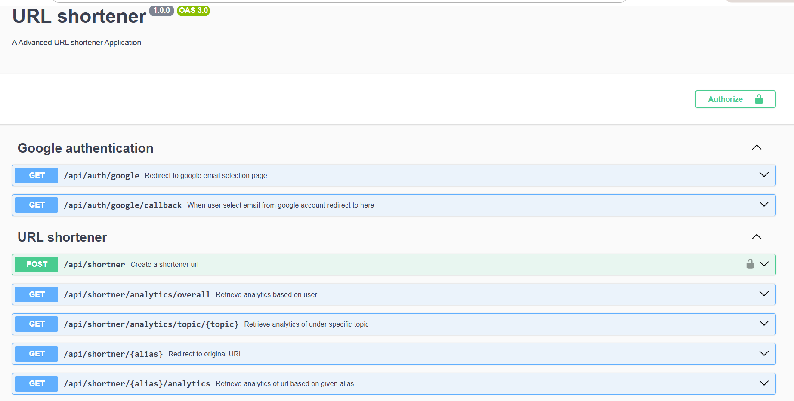
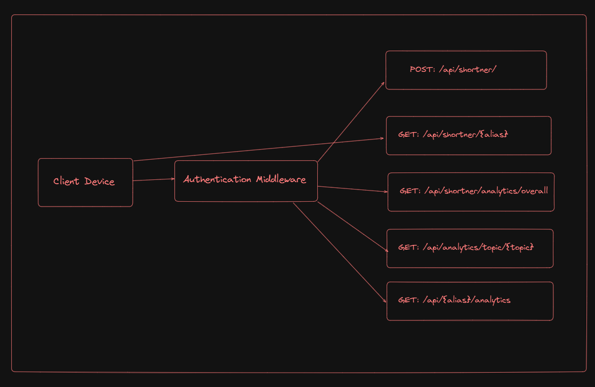

# URL shortener

This is a url shortener application users can efficiently short url

#

## Guild lines setup this project

Open Terminal and run the following commands

1. `git clone https://github.com/mohamedaflah/Advanced_URL-shortener.git`

2. create .env file in root of project directory and add .env data based .env.sample

3. `docker compose up`

4. You can open application at http://localhost:4200

5. Ensure the environment setup is complete by verifying that all required environment variables are properly configured as per the `.env.sample` file, Docker is installed and running on your system, and all necessary dependencies and tools are installed and set up correctly.

###### Please email me the required .env file details at mohamedaflah186@gmail.com to proceed further. Let me know if you need any additional information from my side. Looking forward to your response!

## APi docs

#### http://localhost:4200/api-docs

## Api docs with swagger

## Application workflow

