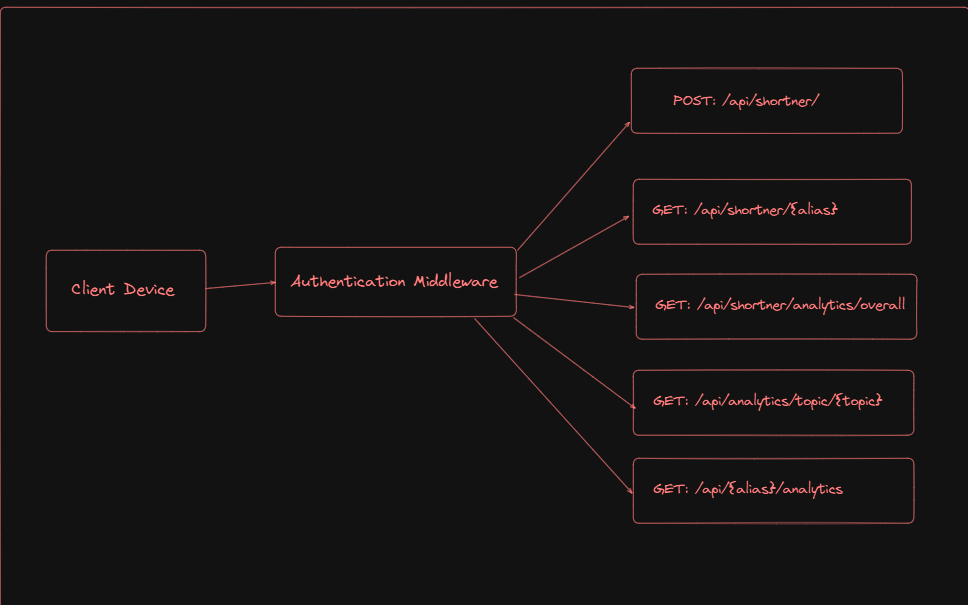

# URL shortener

This is a url shortener application users can efficiently short url

#

## Guild lines setup this project

Open Terminal and run the following commands

1. `git clone https://github.com/mohamedaflah/Advanced_URL-shortener.git`

2. create .env file in root of project directory and add .env data based .env.sample
3. `npm install` `npm run dev`

4. Ensure env setup completed check .env.sample

###### Please email me the required .env file details at mohamedaflah186@gmail.com to proceed further. Let me know if you need any additional information from my side. Looking forward to your response!

## APi docs

###### localhost:4042/api-docs

## Application workflow

